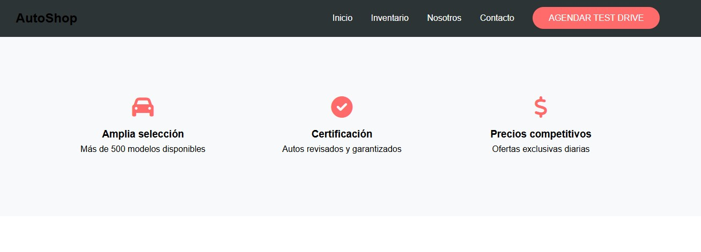

# Proyecto: Landing Page Tienda de Autos 🚗

## Descripción General
Landing page responsive diseñada para una concesionaria de automóviles, enfocada en:
- Uso de imágenes reales profesionales (vía Unsplash API)
- Colores vibrantes y combinaciones modernas
- Efectos visuales atractivos (transiciones, hover effects, animaciones)
- Experiencia de usuario intuitiva

## Características Principales

### 1. Sección Hero 🌟
- Imagen de fondo full-screen con overlay degradado
- Título animado con efecto "fadeIn"
- Botón de llamado a la acción con efecto elevación

### 2. Cuadrícula de Características 🔧
- 3 iconos animados con transiciones suaves
- Diseño responsive (1 columna en móviles, 3 en desktop)
- Efecto de escala al pasar el cursor

### 3. Catálogo de Vehículos 🚗
- Tarjetas de autos con:
  - Imágenes de alta calidad
  - Hover effect con elevación
  - Transición suave en botones
- Sistema de cuadrícula adaptable

### 4. Testimonios 🗣️
- Fondo oscuro con overlay de texto claro
- Diseño en mosaico (2 columnas en desktop)
- Efectos de profundidad en tarjetas

### 5. Footer Informativo ℹ️
- Menú secundario con enlaces importantes
- Iconos de redes sociales interactivos
- Información de contacto y legales
